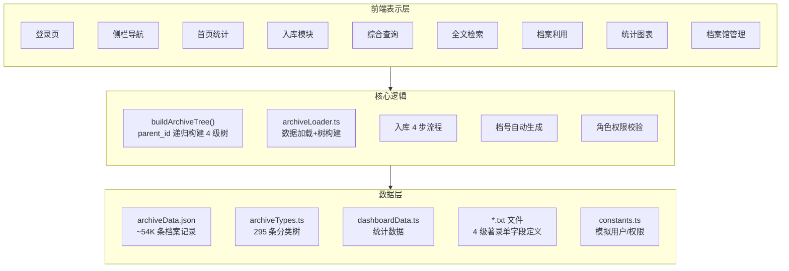
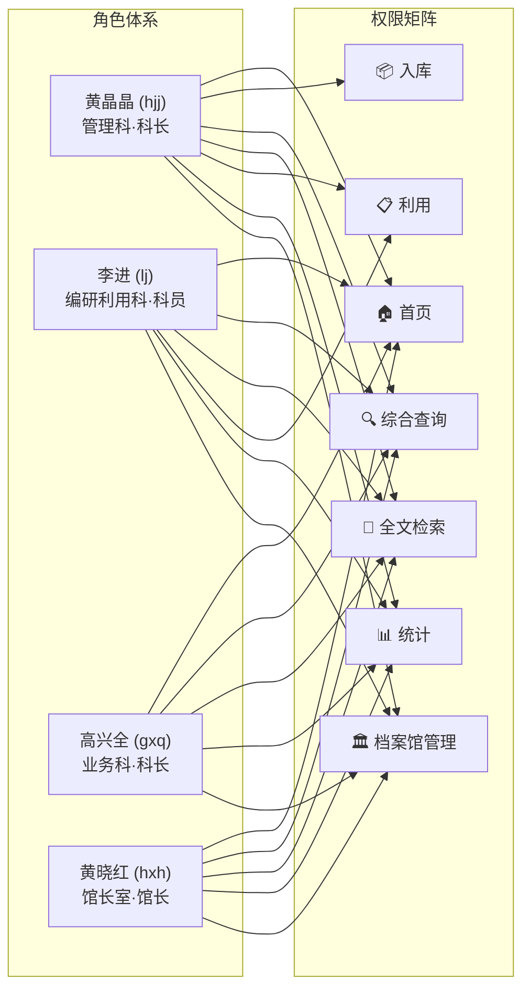
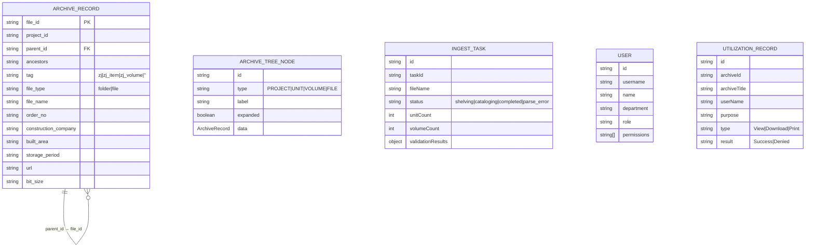
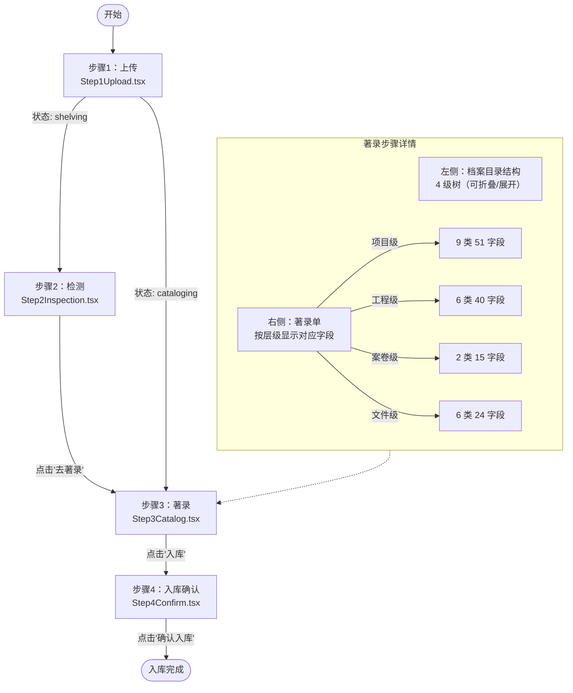

# 业务逻辑与流程

> 兰台云-数智馆藏——业务层设计文档。

---

## 整体架构



---

## 角色体系



权限校验在 `App.tsx` 中通过 `currentUser.permissions.includes(currentView)` 实现，越权访问显示"访问受限"提示。

---

## 数据模型关系



---

## 用户操作流程

### 入库流程（4 步）



### 查询与利用流程


---

## 路由总览

### Hash 路由

| Hash | 视图 | 组件 |
|------|------|------|
| `#/dashboard` | 首页统计 | `Dashboard.tsx` |
| `#/ingest` | 入库管理 | `IngestModule.tsx` |
| `#/search` | 综合查询 | `ComprehensiveSearch.tsx` |
| `#/fulltext` | 全文检索 | `FullTextSearch.tsx` |
| `#/utilize` | 档案利用 | `UtilizationModule.tsx` |
| `#/stats` | 统计图表 | `StatisticsModule.tsx` |
| `#/archive-mgmt` | 档案馆管理 | `ArchiveManagement.tsx` |

路由分发在 `App.tsx` 中通过 `ViewState` 枚举 + `window.location.hash` 实现。不支持外部路由框架，使用原生 hashchange 事件监听。

### 侧栏导航（ViewState）

```
ViewState enum:
  HOME = 'home'          → #/dashboard
  INGEST = 'ingest'      → #/ingest
  COMPREHENSIVE = 'search'  → #/search
  FULLTEXT = 'fulltext'  → #/fulltext
  UTILIZE = 'utilize'    → #/utilize
  STATS = 'stats'        → (侧栏不直接暴露，从首页进入)
  ARCHIVE_MGMT = 'archive_mgmt' → #/archive-mgmt
```
